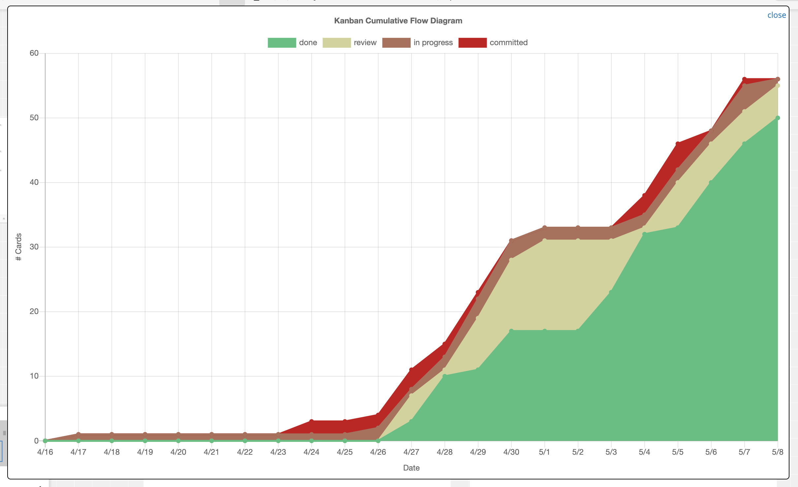

# Conceptboard Tools for Kanban
1. [[#Short%20installation%20and%20usage%20guide]]
	1. [[#Getting%20Started]]
		1. [[#Collecting%20Data]]
			1. [[#Example]]
		2. [[#Inserting%20the%20Scripts%20into%20Conceptboard]]
		3. [[#Usage]]
	2. [[#Links]]
2. [[#Extended%20installation%20and%20usage%20guide]]
	1. [[#Tampermonkey]]
	2. [[#Conceptboard]]

# Short installation and usage guide

This repository provides a simple javascript snippet to be inserted into conceptboard e.g. via the tampermonkey plugin for google chrome.

  
  

## Getting Started

  

### Collecting Data

The tooling relies on manually collected data about ticket. This means, for every ticket, a simple text box has to be maintained, respecting a certain format.

  

#### Example

  

```

MetricsType: reality

selected: 2021-04-26 13:30

work: 2021-04-26 15:30

work end: 2021-04-26 15:40

done: 2021-04-27 10:15

```

  

Description:

* The text needs to start with `MetricsType: `.

* The keyword following `MetricsType` will be used ad card or working type to classify cards.

* Afterward, pairs of status and timestamp can be listed.

* The timestamps must follow the format YYYY-MM-DD hh:ii

  
  

### Inserting the Scripts into Conceptboard

Currently, two ways of inserting the script into conceptboard are tested:

  

**Direct Injection via Javascript Console**

  

You can simply copy the contents of the file `src/tampermonkey-script.sh` into the javaacript console inside the scope of your conceptboard.

  

**Usage of Tampermonkey**

You can use tampermonkey to be integrated into conceptboard automatically. Make sure to adapt the domain name of your concept board account in the script file, if your using an enterprise account with a unique subdomain of conceptboard.

  

### Usage

After a successful integration, you can see three additional buttons in the top icon bar of concept board.

  

Click the to get the diagram with statistics about all cards **that are

currently in or near your actual selected view of the board**.

  

**Example for a CFD**

  



  
  


# Extended installation and usage guide

## Tampermonkey

- download and install Tampermonkey for your browser; visit the [[#Links]] for further help
-  open Tampermonkey menue
  
- Create a new script
- Delete generated content from editor
- Copy script from [[src/tampermonkey-script.js]] and paste into the editor
- Things that may be changed depending on your layout:
	- @match : link to your conceptboard 
	- colDone : should match your last column on your conceptboard [[#Example|see%20done%20in%20example]]
	- colStart : should match your first working column on your conceptboard [[#Example|see%20work%20in%20example]]
	- colLabel : doesn't need to be changed
	- metrics_prefix : should match your metrics type [[#Example|see%20MetricsType%20in%20example]]
	- column1 to x : should fit your columns with 1 beeing the last column of your board e.g. done and the colour you want to have in the CFD for this column. If you have more or less columns then just add or remove some and change dateColumns and cfdOptions accordingly
	- dateColumns : is a list of column Names (columnX\[0\])
	- cfdOptions : "columnName", "columnLabel", "columnColor" - columnLabel can differ from columnName to hide technical names of columns
	- discardedColumn : should match your column for discarded cards
	- typeToColor : key should match your desired metrics types, value is the color you want to assign in the metrics
	- partition : time partition used for the LTD
- Save (Ctrl + S or File > Save) 

## Conceptboard

- visit your personal or company conceptboard; visit the [[#Links]] for futher help
- in the toolbar of conceptboard 3 icons should be visible on the right side
  
-  click on these icons to show statistics for the visible part of your conceptboard
- every shape that is filled out correctly will be included in the statistics
	- all necessary informations have to be on one shape e.g.
	  

# Links

- Conceptboard: https://conceptboard.com/

- Tampermonkey: https://www.tampermonkey.net/ (available Browsers: Chrome, Edge, Safari, Firefox, Opera, Dolphin & UC)

- Tampermonkey for Chrome: https://chrome.google.com/webstore/detail/tampermonkey/dhdgffkkebhmkfjojejmpbldmpobfkfo?hl=de